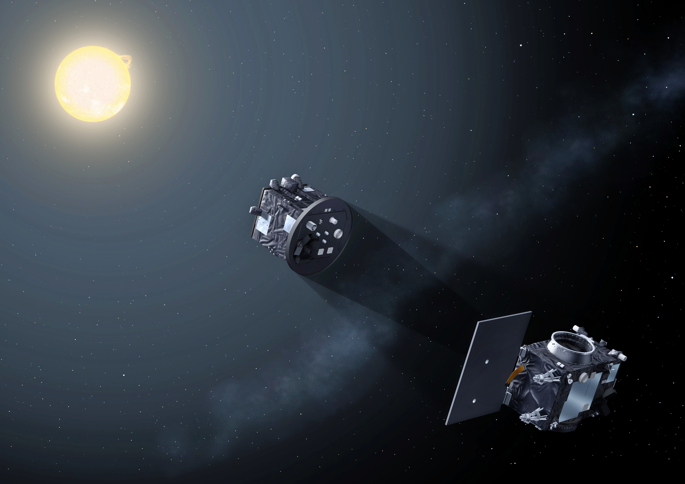
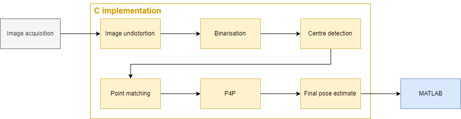
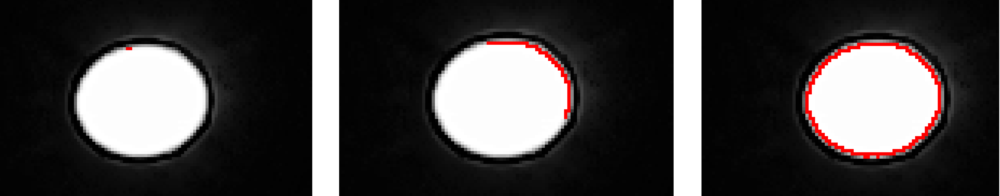
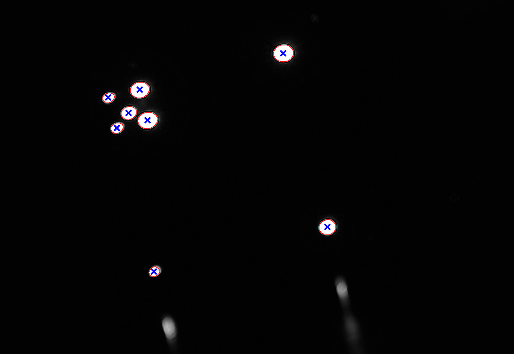
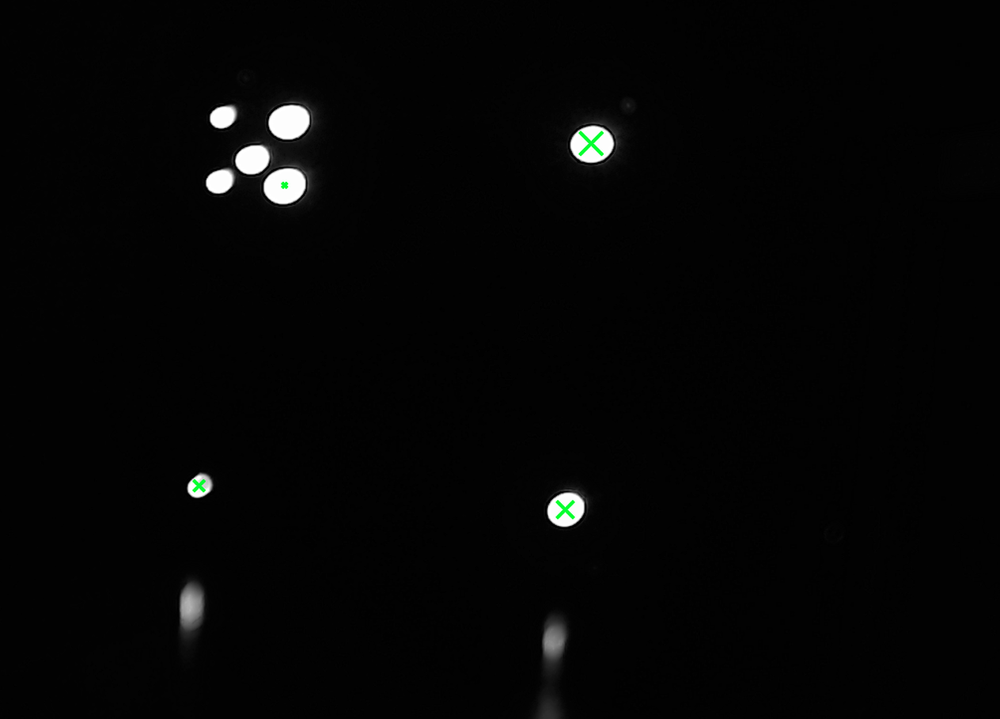
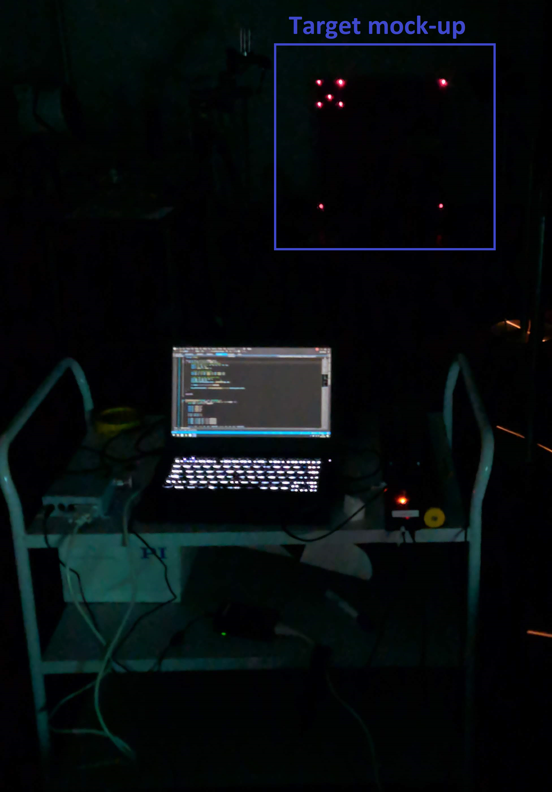

# PROBA3

## Summary
PROBA3 double-satellite LED pattern recognition and pose 
synchronisation using image analysis implemented in C. 
This is a project for DTU course 30330.

## Usage
You can try out the program by going into the Release folder 
and running the PROBA3.exe file.

## Detailed description
This project presents a proof of concept implementation of a 
vision based pose estimation algorithm used to achieve high 
precision formation flying for the PROBA-3 mission satellites. 
The chosen algorithm is Abidi’s P4P method based on volume 
measurements of tetrahedra. The implementation is done in C 
using some functionality of the OpenCV library. The accuracy of 
the algorithm was evaluated in 4 different test cases. 
In comparison to an external estimate (one produced by built-in 
MATLAB functions), the final accuracy achieved was around 0.1 degrees 
for the orientation and 8.46 mm for the translation. This could 
possibly be further improved.

## Visual explanation and results
### Code block diagram and pipeline:

### Finding contours
3 different phases of the contour search algorithm substep: 
1. after initialisation
2. after the 50th iteration
3. after the start pixel is found again

   
### Finding centers
Output of the center-finding algorithm:

### Identifying unique keypoints
The 4 chosen unique output points as the input for the Abidi's Perspective-4-Point (P4P) algorithm

The different cross-size means a different index.

### Test setup
Test setup for image capturing:

The image samples were taken in dark room:

